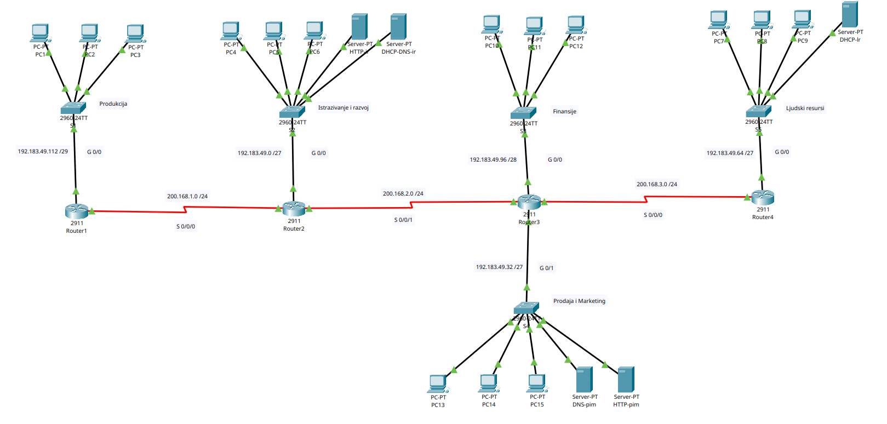

# Enterprise Network Infrastructure Simulation
This project is a full-scale network simulation for a corporate environment consisting of five key departments: Production, R&D, Finance, Sales/Marketing, and Human Resources. 
The objective was to build a scalable, secure, and efficient network that facilitates inter-departmental communication while maintaining strict access controls and providing reliable internet connectivity.

 

 

### Features
- Layer 3 Routing & Switching: Full implementation of routers and switches using 802.1Q VLAN encapsulation for logical network separation.
- Dynamic IP Management: Automated IP assignment using DHCP servers with custom exclusion pools to protect static infrastructure.
- Network Security: Deployed Standard and Extended Access Control Lists (ACLs) to enforce security policies and restrict unauthorized traffic.
- NAT/PAT Implementation: Configured Port Address Translation to allow private subnets to communicate securely with the public internet.
